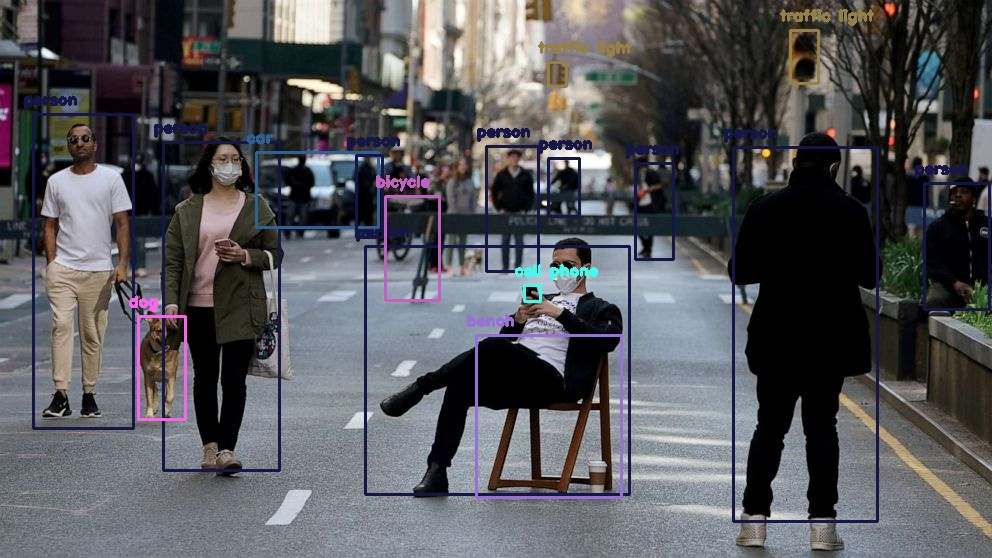

# YOLOv3 Object Detection with OpenCV

## Overview

This project demonstrates how to perform object detection using the YOLOv3 (You Only Look Once) model with OpenCV in Python. YOLOv3 is a state-of-the-art, real-time object detection algorithm known for its speed and accuracy.

## Features

- Load images using OpenCV.
- Perform object detection using the YOLOv3 model.
- Display the results with bounding boxes, class labels, and confidence scores.
- Easily customizable for different use cases, such as detecting specific objects.

## Requirements

Before you begin, ensure you have the following installed:

- Python 3 or higher
- OpenCV 
- NumPy
- YOLOv3 weights and configuration files

### Installation

1. Clone this repository:
    ```bash
    git clone https://github.com/AKhart1/obj-detection-yolo3.git
    cd obj-detection-yolo3
    ```

2. Install the required Python packages:
    ```bash
    pip install -r requirements.txt
    ```

3. Download the YOLOv3 model weights and configuration files (include link to darknet repo):
    - YOLOv3 weights: [yolov3.weights](https://pjreddie.com/media/files/yolov3.weights)
    - YOLOv3 configuration: [yolov3.cfg](https://github.com/pjreddie/darknet/blob/master/cfg/yolov3.cfg)
    - COCO names file: [coco.names](https://github.com/pjreddie/darknet/blob/master/data/coco.names)


## Usage

### Running Object Detection

1. Place your input images in the `images` directory.
2. Run the detection script:

    ```bash
    python detect.py --image images/[yourimage].jpg --config config/[yolo config].cfg --weights config/[yolo weights].weights --classes config/[yolo classes].txt
    ```

### Script Parameters

- `--image`: Path to the input image.
- `--config`: Path to yolo config file.
- `--whights`: Path to the YOLO pretrained model
- `--classes`: Path to a object categories for pretrained yolo model

### Sample output 


